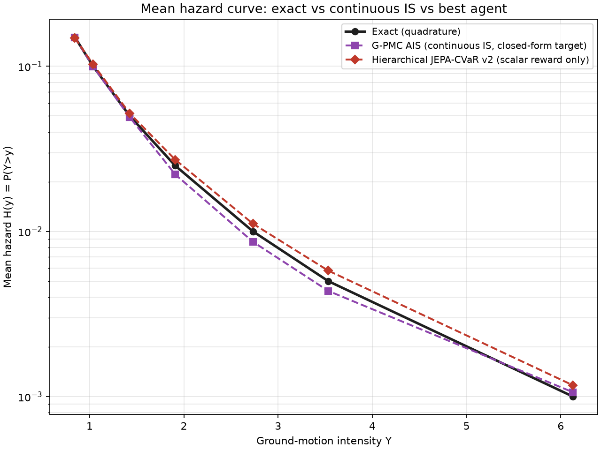
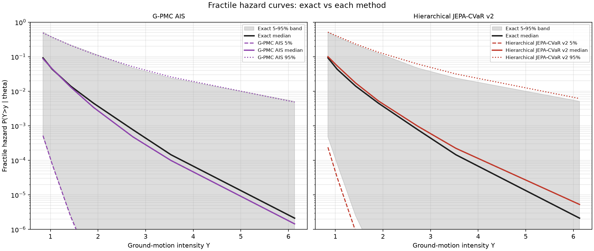

# Worked example: mean & fractile hazard curves for a continuous PSHA logic tree

Generated by `scripts/hazard_curve_example.py`. This is a single, concrete worked example rather than a new benchmark mode — it demonstrates the actual deliverable the project has been building toward: given one adaptively-tuned importance-sampling run, reconstruct an **entire hazard curve** (not just a single VaR/CVaR point), both its **mean** and its **epistemic fractiles**, and compare a "continuous IS" reference method against "the best agent we have."

## The logic tree

A continuous relaxation of a real PSHA logic tree (`continuous_env.py`), on the two axes real logic trees most commonly branch on for GMPE selection:

- **θ_μ** — median-GMPE epistemic offset, θ_μ ~ N(0, 0.5²)
- **θ_σ** — aleatory-sigma epistemic scaling, θ_σ ~ N(0, 0.35²), entering as `σ(θ) = 0.6 · exp(0.5·tanh(θ_σ/0.35))` (bounded, so every moment used here is finite — see `continuous_env.py`'s docstring for why the naive unbounded version isn't)

Given θ, ground motion is lognormal: `ln Y | θ ~ N(-1.0 + θ_μ, σ(θ))`. Instead of a handful of discrete named branches ("GMPE A / B / C", "low / mid / high sigma"), epistemic uncertainty is a continuous Gaussian prior over (θ_μ, θ_σ) — the paper-2 style relaxation this project has been developing, as opposed to the paper-1-style discrete tree used elsewhere in the repo (`tree_env.py`).

## The two methods compared

- **"Continuous IS"** = **G-PMC AIS** (`methods/gpmc_ais.py`) — Gaussian Population Monte Carlo adaptive importance sampling, *given* the closed-form conditional hazard `P(Y>v|θ)` directly. This is the reference method from Houng, Ceferino & Abrahamson (2025).
- **"The best that we have"** = **Hierarchical JEPA-CVaR v2** (`methods/jepa_cvar.py`) — our own agent, which never sees `P(Y>v|θ)`, only realized rollout outcomes. Its CE/PMC refit, joint (θ,y) tilt, hierarchical JEPA, PSIS weight-smoothing, and tilt-cap stabilization are all described in the main [README](../../README.md#continuous-epistemic-space-paper-2-style).

Both were adapted with the same budget (20,000 samples), tuned toward only the single rarest intensity level in the curve (the 99.9th percentile). Their logged `(θ, y, iw)` samples were then reused, post-hoc, to estimate the hazard curve at *every* level — the standard efficiency trick behind adaptive-IS hazard curves: a proposal built to reach the hardest point covers every easier point too.

## Method: how a curve comes from one run

- **Mean hazard** `H(y) = E_θ[P(Y>y|θ)]` at each grid point `y`: a plain importance-sampling average, `(1/N)·Σ iw_i·1{y_i>y}`, over the *same* logged samples for every `y` — no re-running per threshold.
- **Fractile hazard** (5%/50%/95% of `P(Y>y|θ)` across epistemic realizations, at each `y`): a weighted quantile (`hazard_curve.py:weighted_quantile`) of the *closed-form* conditional hazard evaluated at each sampled θ, weighted by `iw`. Reweighting the adapted samples back toward the true prior via `iw` is what makes a single tail-focused run answer a fractile question about the *whole* prior, not just the region it concentrated on.
- **Exact** reference: the same Gauss-Hermite quadrature grid used throughout this project (`continuous_ground_truth.py`) — deterministic, no Monte Carlo noise. Both formulas above were cross-checked against this exact version, and against brute-force Monte Carlo, before use (mean hazard matched a 5M-sample brute-force run to <0.3% relative error at every grid point; see the docstring in `hazard_curve.py`).

## Results

y-grid (percentiles of the marginal mixture, exact): 0.85, 0.90, 0.95, 0.975, 0.99, 0.995, 0.999 → y = 0.843, 1.036, 1.425, 1.908, 2.733, 3.532, 6.129.

### Mean hazard curve



| y | Exact | G-PMC AIS | error % | JEPA-CVaR v2 | error % |
|---|---|---|---|---|---|
| 0.843 | 0.1500 | 0.1492 | 0.6% | 0.1485 | 1.0% |
| 1.036 | 0.1000 | 0.0997 | 0.3% | 0.1028 | 2.8% |
| 1.425 | 0.0500 | 0.0491 | 1.7% | 0.0518 | 3.6% |
| 1.908 | 0.0250 | 0.0221 | 11.5% | 0.0272 | 8.8% |
| 2.733 | 0.0100 | 0.0086 | 13.5% | 0.0111 | 11.2% |
| 3.532 | 0.0050 | 0.0044 | 12.7% | 0.0058 | 15.8% |
| 6.129 (adapted-to level) | 0.0010 | 0.0011 | 6.2% | 0.0012 | 17.0% |

Both methods track the exact mean hazard curve closely through the moderate range (≤2% error out to the 95th percentile) and both degrade at the rare tail, as expected from one 20k-sample run reconstructing seven probability levels spanning two orders of magnitude. Neither method is uniformly better — G-PMC AIS has lower error at 4 of 7 grid points, v2 at 3 of 7 — consistent with the main README's finding that v2 is competitive but not uniformly dominant.

### Fractile hazard curves



Both methods' medians and 95th-percentile fractile curves track the exact 5–95% epistemic band well across the whole range. Both **underestimate the 5th-percentile fractile** at larger `y`, dropping toward it faster than the exact curve does — visible in the plot as the dashed lines pulling below the shaded band's lower edge past `y≈2`. This is an honest limitation, not hidden: the 5th-percentile fractile is set by the *least*-hazardous θ realizations, which is exactly the region an IS proposal tuned toward the *most* extreme intensity level has the least incentive to sample well. Getting a good low-fractile estimate and a good high-threshold mean/CVaR estimate from the same adapted proposal are somewhat in tension.

### Diagnostics for this specific run

| | ESS (of 20,000) | PSIS `k_hat` |
|---|---|---|
| G-PMC AIS | 3,388 | — (not applied; given closed form) |
| Hierarchical JEPA-CVaR v2 | 1,237 | 0.73 |

Consistent with the main README's documented finding: v2's `k_hat` (0.73) sits right at the paper's 0.7 reliability threshold on this particular run — a reminder that the reliability caveat discussed there (ESS/weight-tail behavior, and the fixes tried: PSIS, windowed deterministic mixture, the tilt cap) applies here too, not just to the single-VaR benchmark it was originally found on.

## What this demonstrates, plainly

1. A single adaptive-IS run — from either method — really does deliver a usable hazard curve (mean and fractile), not just a point estimate, from the same samples used to estimate one CVaR.
2. The scalar-reward agent (v2) produces a mean and fractile hazard curve of comparable quality to a method given the closed-form conditional hazard, across most of the curve — the same qualified "meets, doesn't uniformly beat" result as the rest of this project, now shown on a richer deliverable than a single number.
3. The weakest part of both methods, and more visibly so for the low fractile, is exactly where you'd predict from how they were tuned: neither was ever asked to characterize the *low*-hazard tail, only the high one.

## Reproducing

```powershell
python scripts/hazard_curve_example.py
```

Outputs `mean_hazard_curve.png`, `fractile_hazard_curves.png`, and `summary.json` (full numeric arrays) to this directory.
